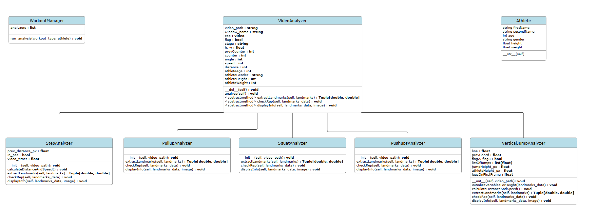
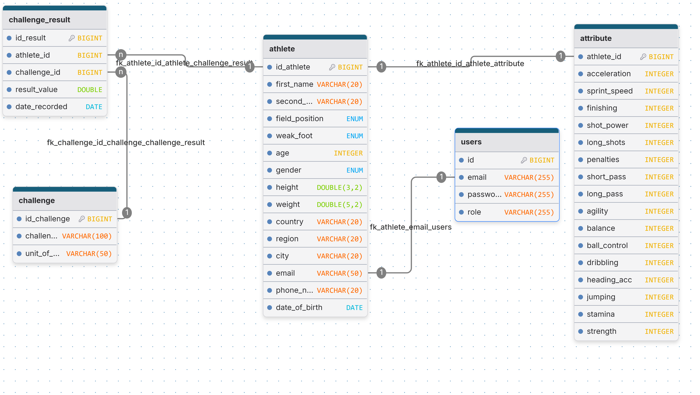

| Date | Version | Updates |
| :--- | :---: | ---: |
| 24.11.2025 | 1.0 | We implemented 5 types of exercises, push-ups, squats, pull-ups, treadmill running and vertical jumps + documentation in the implementation of this project |
|  |  |  |
|  |  |  |


# TalentBridge 

### Short description
This project is a Python-based video analysis application designed to identify and evaluate athletic talent for football clubs. It employs computer vision methods to evaluate athletes physical performance and enhance optimal player-to-club pairing

### Problems the app solves:
TalentBridge wants to help football teams that are finding it increasingly difficult to find players compatible with their needs, but also players who are having a hard time getting noticed by teams.

### Opinions of experienced professionals in the field

Micu Bogdan, Video Analyst at Hagi Academy
```
Question: What matters more in the beginning: technical qualities (ball touch, dribbling, passing) or physical qualities (speed, endurance, coordination)? 
Answer: "It's a combination of both elements. However, I would tip the scales towards technical qualities because you can still work on the physical side."

Question: Do you use a scoring system or more of a subjective evaluation based on experience? 
Answer: "Technical and physical tests, and we draw conclusions based on expertise grounded in experience and video footage."
```
Youth Coach at FCSB (ANONYMOUS)
```
Question: What are the main criteria you look for when you see a child for the first time?
Answer: "The main criterion is intelligence and the capacity for intrinsic motivation."

Question: What types of exercises or tests do you use to evaluate children's abilities?
Answer: "Tests on motor qualities and motor skills."

Question: What matters more in the beginning: technical qualities (ball touch, dribbling, passing) or physical qualities (speed, endurance, coordination)?
Answer: "Speed, coordination, and striking the ball are important for the start."

Question: Do you use a scoring system or more of a subjective evaluation based on experience?
Answer: "Empirical evaluation is not necessarily the correct one."

Question: How do you observe or evaluate these aspects in children?
Answer: "Psychological tests and/or attitude in matches and training."

Question: Is the child's attitude important in the selection stage, or is it developed during sports development?
Answer: "It is important at selection, and if they pass the selection, then an improvement of all training factors follows."

Question: What criteria do you consider when deciding whether a child is better suited for a large club or a smaller one?
Answer: "There is no such criterion; the club where they go for selection decides whether to keep them or not."
```
Turcu Lucian Dan, Physical Trainer at Universitatea Cluj, Liga1 Romania Team
```
Question: What types of exercises or tests do you use to evaluate athletes' abilities?
Answer: "To evaluate athletes physically, we use a set of periodic tests that start in the Pre-Competitive period and are repeated monthly or every 6 weeks. To test Work Capacity, we use one of the '30-15' tests, the YO-YO Intermittent Recovery test, or the 5-minute Test. We use FMS to evaluate mobility. For strength, we use a device called an Encoder which shows the athlete's explosive strength and estimates maximal strength. To see maximal speed, we use the GPS system which shows the athlete's maximal speed and sprint meters.
From a technical-tactical point of view, the athlete is evaluated during training and matches, and certain points are tracked. The cognitive part is very important: how quickly they adapt to new situations arising in training, what solutions they find, how they respond to the coaches' instructions, and how quickly they assimilate information. However, there are certain tests used in Football Academies during the formation period. Examples: Cognitive and perception-decision tests, the mentioned physical tests, technical tests, psychological and behavioral tests, growth and biological maturity tests."

Question: What matters more in the beginning: technical qualities (ball touch, dribbling, passing) or physical qualities (speed, endurance, coordination)?
Answer: "In the (optimal) learning period, the most important are cognitive and psycho-social qualities. Another very important component is the understanding of the game of football (decision-making)."

Question: Do you use a scoring system or more of a subjective evaluation based on experience?
Answer: "In the personal development files, there is both an objective score (e.g., physical tests) and a subjective score (e.g., understanding the game and instructions). Considering that an athlete in the formation period does not have linear development, it is wrong to assign only grades. (See cases of famous footballers who were rejected in the past because they had poor results or parameters in certain tests. Yet they went on to achieve significant performance)."

Question: How do you observe or evaluate psychological and attitude aspects in athletes?
Answer: "Interpretable. As I mentioned above, we aim to set clear tasks and objectives. Through video analysis, we can see much more accurately whether these tasks are fulfilled. The analysis is done predominantly 'in the office' and not on the field. Following video analysis, we draw conclusions, set training objectives, and help athletes develop."

Question: How important do you consider visual feedback (graphs, slow-motion clips) for athlete development?
Answer: "If we are talking about motor skills, it is very difficult to change an athlete's movement pattern without knowing what determines them to move in that way. That is why we concretely test mobility, flexibility, muscular imbalances, the agonist-antagonist muscle ratio. From this, we can draw fairly clear conclusions. For example, an athlete who runs with their toes turned outward may have hyperactive gluteus medius muscles and hypoactive adductors (this is just an example). You will not be able to correct their movement unless you intervene on these imbalances. For this reason, we do not rely on images and movement patterns. The running biomechanics of Cristiano Ronaldo are different from Messi's and Usain Bolt's. Is any of them wrong? Probably not; they are just adapted to the needs of each."

Question: Can you tell me some simple tests through which you extract some attributes?
Answer: "It is possible to extract some valuable information even from a slow-motion video. I'll give you an example. If an athlete is very prone to injuries despite all the tests I mentioned being within normal parameters, it is possible that these injuries are due to running biomechanics. During slow-motion running, I would look very closely at: hip flexion (if they lift the thigh sufficiently), knee extension before ground contact, dorsi-flexion at the moment the foot pushes off the ground, spine and shoulder position, if the hip internally rotates when the foot touches the ground."
```
### Technologies Used
* **Python** (Base Language)
* **MediaPipe Pose** (For skeletal landmark detection)
* **OpenCV** (For video processing)
* **NumPy** (For matrix calculations and angles)

### So far:
Exercise Evaluation: The system analyzes a range of exercises, including:
```
-Push-ups
-Squats
-Pull-ups
-Treadmill Running
-Vertical Jumps
```
### UML diagram:


### Data base:
The database environment is built using modern virtualization, isolation, and efficiency.

| Component | Role | Documentation |
| :--- | :---: | ---: |
| WSL 2 | Host environment for Docker on Windows. Provides a Linux kernel for optimal performance. | [Microsoft WSL Docs](https://learn.microsoft.com/en-us/windows/wsl/) |
| Docker | Containerization platform used to package and run the MariaDB server. | [Docker Documentation](https://docs.docker.com) |
| MariaDB | The relational database management system (RDBMS) storing all athlete and performance data. | [MariaDB Documentation](https://mariadb.com/docs/) |

1. Docker and Containerization
The core database engine is run as a Docker container using the official mariadb image.
Isolation: The database runs in an isolated environment, preventing conflicts with other software on the host machine.
Portability: The entire environment can be spun up on any machine running Docker using a single docker run command.
Persistent Storage: A Docker Volume is used to ensure all data (-v mariadb_data:/var/lib/mysql) persists even if the container is stopped, updated, or removed.

2. WSL 2 Integration
For Windows users, Docker Desktop leverages Windows Subsystem for Linux (WSL) 2. This method significantly improves the performance of the Linux-based MariaDB container by utilizing a lightweight, integrated Linux kernel, offering near-native performance compared to older virtualization methods.

3. Database Access
The MariaDB container is mapped to the host machine's port 3306, allowing connection via standard tools (DBeaver, MySQL Workbench, etc.) using:
Host: localhost
Port: 3306
User: root
Database: db_talentbridge


### How to run the code:
```bash
git clone https://github.com/vasilca-rares-mihai/TalentBridge.git
cd nume-proiect

pip install -r requirements.txt
```


